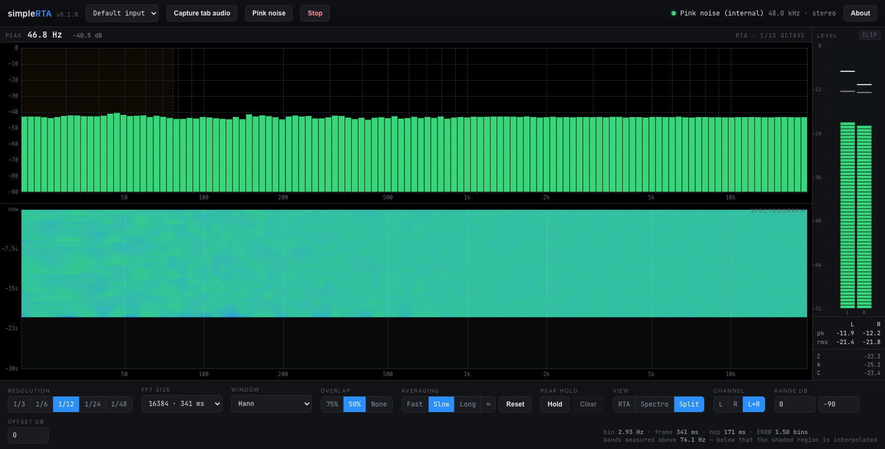

# simpleRTA user guide

**A real-time audio analyser that runs entirely in a browser tab.** RTA, spectrograph and a level
meter, sharing one frequency axis.

*Split view on the built-in pink noise. **Pink noise is flat on a constant-percentage-bandwidth
display, so a correct analyser draws a level line** — which is what makes this the picture worth
checking a change against.*

> **Before you rely on this:** the analysis chain is verified numerically — 29 tests pin the power
> normalisation at every transform size and through every window, the band-integration invariants,
> and the agreement between the band levels and the spectrum they come from. The running app is
> checked against its own pink-noise source.
>
> **It has not been verified against a calibrated measurement microphone or a reference analyser,
> and no absolute SPL claim is made.** The dB offset field is an unverified number you supply, and
> **there is no microphone correction.**
>
> This codebase was created with AI assistance, directed and reviewed by a human author.

---

## Start on pink noise

**Pink noise is generated in the page and analysed without going anywhere near the speakers.**

Because pink noise is flat on a constant-percentage-bandwidth display, a correct analyser draws a
level line. **That is the check that the analyser reads level, before you trust what it says about
a room.** Do it once, on any new machine or browser.

---

## Sources

**An audio input** — a microphone, a measurement mic on an interface, or a return from a console.
The browser's **echo cancellation, noise suppression and automatic gain are all switched off**, so
what you see is the signal rather than the voice pipeline the browser would otherwise hand you.

**Tab audio** — captures what another browser tab is playing. Pick a tab in the picker and tick
*Share tab audio*. **Whole-window and full-screen shares carry no audio on most platforms.** Chrome
and Edge only.

**Pink noise** — as above.

---

## Reading the display

Levels are **dBFS**, on the convention that a full-scale sine reads 0 dB.

The **offset** field adds a constant to everything shown, so with a reference of known level you
can dial the scale into SPL. **Nothing verifies that number, and no microphone correction is
applied** — so it is a working scale, not a measurement.

### The shaded region is arithmetic, not a fault

At the fine resolutions **the low bands are narrower than the transform can actually resolve.**
Below the frequency stated under the controls, neighbouring bands report *shares of a single
measurement* rather than independent ones, and the RTA shades that part of the graph.

It is the arithmetic of asking a 341 ms transform for 1/48-octave detail at 30 Hz. **Lengthen the
transform, or use a coarser resolution, and the shading recedes.**

| Resolution | 16384-point transform, 48 kHz | 65536-point |
|---|---|---|
| 1/3 octave | resolved from 20 Hz | 20 Hz |
| 1/12 octave | 76 Hz | 19 Hz |
| 1/48 octave | 304 Hz | 76 Hz |

**Do not read a difference inside the shading as a difference in the room.**

### Which window

| | |
| --- | --- |
| **Hann** | Anything ordinary. |
| **Blackman-Harris** | To see a quiet tone next to a loud one — it buys −92 dB sidelobes at the cost of a wider main lobe. |
| **Flat-top** | When the **amplitude** of a tone matters more than its frequency: accurate to about 0.01 dB wherever the tone falls between bins, with poor frequency resolution in exchange. |
| **Rectangular** | Only for signals that are periodic within the frame. |

**Flat-top is the one people reach for too rarely.** If you are matching levels between two tones,
Hann will cost you up to 1.4 dB depending on where the tone lands.

---

## What else is on screen

- **RTA** at 1/3, 1/6, 1/12, 1/24 or 1/48 octave
- **FFT size** 2048 to 65536, with a selectable window and overlap
- **Peak hold** per band, and exponential or infinite averaging
- **Spectrograph** sharing the RTA's frequency axis
- **Full-height bargraph meter** — peak, RMS, peak hold and a latching clip indicator, plus
  broadband Z / A / C readouts

No backend, no accounts, no telemetry. The audio is analysed on the page and never leaves the
browser.

---

## If something looks wrong

| Symptom | Cause |
| --- | --- |
| **Pink noise does not draw flat** | Something is wrong before you look at any room. Check the source and the offset. |
| **The low end is shaded** | The transform cannot resolve those bands. Lengthen it or coarsen the resolution. |
| **Tab audio is silent** | Whole-window and full-screen shares carry no audio on most platforms. Pick a tab. |
| **Two tones read different levels at the same amplitude** | Window scalloping loss. Use flat-top. |
| **The SPL number is wrong** | It is your offset. Nothing here verifies it, and there is no mic correction. |
